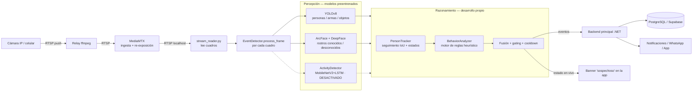
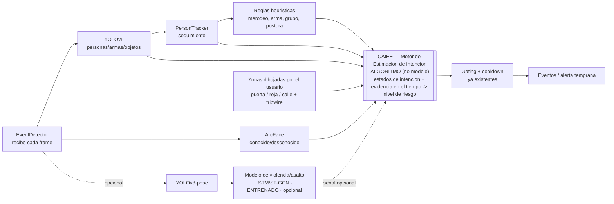
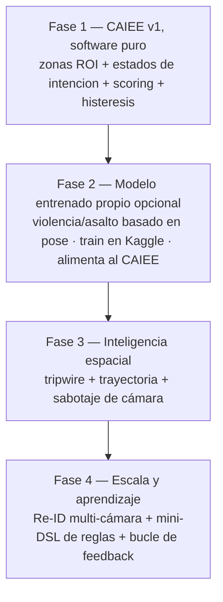

# VigiShield — Componente de IA: Arquitectura AS-IS / TO-BE

> Documento técnico del **componente de inteligencia del sistema** (backend de IA en Python).
> Describe qué existe hoy (**AS-IS**) y hacia dónde puede evolucionar (**TO-BE**), separando
> con honestidad lo que son **bloques estándar preentrenados** de lo que es **desarrollo propio**.

**Última actualización:** 2026-09-16

## Estado de implementación

| Componente | Estado | Dónde |
|---|---|---|
| YOLOv8 + ArcFace + reglas + PersonTracker | ✅ En producción | `event_detector.py` |
| **Zonas de interés (ROI)** dibujadas por el usuario | ✅ **Implementado** (rama `feature/zones-caiee`) | `zones.py` · backend `CameraConfig.ZonesJson` · app `zone_editor_screen.dart` |
| **CAIEE** — motor de intención anticipatoria | ✅ **Implementado** (rama `feature/zones-caiee`) | `caiee.py` + `event_detector.py` |
| Modelo de violencia/asalto (pose/LSTM) | 🔜 Futuro (opcional) | — |
| Otras piezas (tripwire, trayectoria, Re-ID, DSL…) | 🔜 Futuro | — |

> Nota: Zonas + CAIEE ya están integrados y validados (self-test offline). Falta
> **aplicar la migración de BD** en producción (columna `ZonesJson`, ya idempotente)
> y **calibrar umbrales** con grabaciones reales — ver `caiee.py`.

---

## 1. Resumen ejecutivo

VigiShield es un sistema de videovigilancia inteligente. El **componente de IA** no es "una app que usa IA":
es un **motor de razonamiento en tiempo real** que toma las salidas crudas de varios modelos de visión
y decide, con lógica propia, si lo que ocurre frente a la cámara es **sospechoso**.

La distinción central que sostiene todo el documento:

- **Los modelos de percepción** (YOLO, ArcFace) están **preentrenados**: son *sensores* estándar.
- **La capa de decisión** (motor de reglas + rastreador + orquestador de eventos) es **desarrollo propio**:
  es el *cerebro* del sistema y es lo que diferencia al proyecto.

---

## 2. AS-IS — Arquitectura actual

### 2.1 Flujo general del pipeline

**Lectura corta:** la cámara publica video → MediaMTX lo recibe → el backend de IA lee cada cuadro →
corren los modelos de percepción → **la capa propia** rastrea personas, aplica reglas y fusiona señales →
si algo supera los filtros, se emite un **evento** al backend principal, que notifica al usuario.

---

### 2.2 Capa de percepción (modelos preentrenados — bloques estándar)

Estos modelos **no los entrené**; se usan tal cual. Son el equivalente a usar una base de datos que uno no programó.

| Componente | Modelo | Qué produce | Detalle de implementación |
|---|---|---|---|
| `YoloDetector` | **YOLOv8** (COCO) | Cajas de personas, armas y objetos con confianza | Las armas de fuego no están en COCO → se usan `knife / baseball bat / scissors` como *proxy* de arma cercana. Umbral bajo para dibujar (0.35), alto para alarmar (0.45). Lista blanca de objetos para evitar basura (door→refrigerator, etc.). |
| `FaceRecognizer` | **ArcFace** vía **DeepFace** | Rostros conocidos (autorizados) vs desconocidos | Solo busca rostros **dentro del recorte de cada persona** (no en toda la imagen), y **reescala** el recorte para que ArcFace funcione con caras lejanas. Umbral de distancia para decidir "conocido". |
| `ActivityDetector` | **MobileNetV2 + LSTM** (entrenado sobre UCF-Crime) | Clasifica una acción en una ventana de 16 cuadros | **Entrenado por mí** (transfer learning), pero **desactivado en producción** (`ACTIVITY_ENABLED=false`): era ruidoso y pesado en escenas domésticas. Documentado aquí por transparencia. |

> **Nota de honestidad para la defensa:** YOLO y ArcFace son preentrenados. El `ActivityDetector` sí es
> un modelo entrenado por mí (transfer learning sobre un dataset público), pero **hoy no maneja las alertas**;
> las decisiones actuales las produce la **capa de razonamiento propia** (sección 2.3).

---

### 2.3 Capa de razonamiento — **desarrollo propio** (el núcleo diferenciador)

Aquí vive el trabajo intelectual del proyecto. Nada de esto es un modelo entrenado ni una librería:
son **algoritmos que programé** que trabajan **sobre las salidas** de los modelos de percepción.

#### 2.3.1 `BehaviorAnalyzer` — Motor de reglas heurístico
Fusiona señales en **tiempo** y **geometría** para concluir comportamiento. **No es random forest ni un modelo:
es un motor de reglas.**

| Regla | Lógica | Algoritmo |
|---|---|---|
| **Merodeo** | Persona presente de forma continua > umbral (25 s), con *gap-reset* para que una desaparición breve no reinicie el reloj | Temporizador de permanencia |
| **Persona armada** | El recuadro del arma **se solapa** con el de una persona (no basta un arma suelta) | IoU + centroide dentro de caja |
| **Grupo** | 3 o más personas simultáneas | Conteo |
| **Postura agachada/tirada** | El recuadro es más ancho que alto (`alto/ancho < 0.9`) | Relación de aspecto |
| **Mirando a la cámara** | Rostro grande y centrado en el encuadre | Geometría de la caja del rostro |

- **Vive en:** `event_detector.py` → clase `BehaviorAnalyzer`.
- **Se ejecuta:** en cada cuadro, después de YOLO + rostros.
- **Por qué:** ningún modelo entrega "comportamiento"; hay que codificar el conocimiento del dominio.
- **Tamaño aprox.:** ~60 líneas (clase) + ~20 de ayudantes de geometría.

#### 2.3.2 `PersonTracker` — Seguimiento de personas propio
Le da **memoria** al sistema. Implementado desde cero (no es una librería).

- **Asociación de datos por IoU voraz:** empareja cada persona del cuadro con el *track* que más se le solapa.
- **Máquina de estados por persona:** `pending → known / unknown`.
- **Ventana de gracia:** una persona nueva tiene ~8 s para ser reconocida antes de alertar como desconocida.
- **Identidad persistente:** una vez reconocida, sigue "conocida" aunque voltee la cara.
- **Alerta única + TTL:** cada persona alerta una sola vez; si se va y vuelve pasado el TTL, cuenta como nueva.

- **Vive en:** `event_detector.py` → clase `PersonTracker`.
- **Por qué:** sin seguimiento, el sistema repetiría la misma alerta cientos de veces y no distinguiría
  "persona nueva" de "la misma persona".
- **Tamaño aprox.:** ~64 líneas (clase) + ~40 de integración.

#### 2.3.3 `EventDetector` — Orquestador, fusión y **supresión de falsas alarmas**
La parte más difícil y menos visible: que el sistema **no grite lobo**.

- **Filtro de personas confiables:** descarta blobs lejanos/diminutos (por confianza y tamaño).
- **Compuerta de racha (streak gate):** un evento solo persiste si se repite en cuadros consecutivos.
- **Cooldown por tipo de evento:** una misma situación en curso = una sola alerta por ventana de tiempo.
- **Fusión final:** combina todas las señales en una bandera `overall_suspicious` para el banner de la app.

- **Vive en:** `event_detector.py` → clase `EventDetector` (`process_frame`).
- **Tamaño aprox.:** ~200 líneas (de las cuales ~140 son `process_frame`).

---

### 2.4 Propio vs preentrenado/librería (tabla honesta)

| Elemento | ¿Propio? | Detalle |
|---|---|---|
| YOLOv8 | ❌ Preentrenado | Bloque estándar (COCO) |
| ArcFace / DeepFace | ❌ Preentrenado | Bloque estándar |
| MobileNetV2 (backbone del activity) | ❌ Preentrenado | ImageNet |
| Dataset UCF-Crime | ❌ Público | No lo creé yo |
| **Entrenamiento del ActivityDetector** | ✅ Propio | Transfer learning, taxonomía y pesos resultantes míos |
| **BehaviorAnalyzer (reglas)** | ✅ Propio | 100% programado por mí |
| **PersonTracker (seguimiento)** | ✅ Propio | Algoritmo IoU + estados, desde cero |
| **EventDetector (fusión + gating)** | ✅ Propio | Orquestación y supresión de falsos positivos |

---

### 2.5 Dónde corre y esfuerzo

- **Backend de IA (Python):** todo lo anterior corre en la **VM de Azure**, por cada cuadro y por cada cámara.
- **Backend principal (.NET, Oracle):** **solo recibe** los eventos ya decididos, los guarda y notifica. No razona.
- **Líneas de lógica propia:** ~**350 líneas** de razonamiento original dentro de un `event_detector.py` de **944 líneas**
  (el resto: anotación del video, captura de fotos/clips, subida a Cloudflare R2 y carga de modelos).

---

## 3. TO-BE — Evolución propuesta

Objetivo: **más fiabilidad, más escalabilidad y más profundidad de software**, sin romper lo que ya funciona.
Principio rector: **agregar, no reemplazar**. Las reglas siguen siendo la columna vertebral confiable.

### 3.1 CAIEE — Motor de Estimación de Intención (el algoritmo estrella)

> ⚠️ **No confundir:** el **CAIEE es un ALGORITMO** (no se entrena; yo defino su lógica). El **modelo de
> violencia** de la sección 3.2 es un **MODELO** (se entrena) y es **opcional e independiente**. El CAIEE
> funciona **con o sin** ese modelo — no son lo mismo.

**Qué es:** hoy la decisión es **reactiva y booleana** (dispara cuando el hecho *ya* ocurre). El CAIEE la vuelve
**anticipatoria y graduada**: modela que un delito ocurre por **etapas**
(pasar → merodear → inspeccionar → aproximarse → intrusión) y **acumula evidencia en el tiempo** para estimar un
**nivel de riesgo/intención** por persona, alertando **antes** de la culminación (alerta temprana / anti-*reglaje*).
Es un **modelo probabilístico de secuencias (tipo HMM / máquina de estados)** — lógica/matemática que yo diseño,
**sin dataset ni GPU**.

**Dónde encaja:** el CAIEE **es el "cerebro" de fusión** — reemplaza la fusión booleana actual. Consume como
**evidencia** las salidas de percepción (YOLO, ArcFace), las **reglas** existentes, las **zonas** dibujadas por el
usuario y el estado del **PersonTracker**; y —si existe— también el **modelo de violencia** como una señal más.

**Modelo vs algoritmo (clave para la defensa):**

| | Qué es | ¿Se entrena? | ¿Dataset/GPU? | Rol |
|---|---|---|---|---|
| **CAIEE** | **Algoritmo** (HMM / máquina de estados + scoring) | ❌ No | ❌ No | **Cerebro** que estima intención y decide |
| **Modelo de violencia** (3.2) | **Modelo** (red neuronal) | ✅ Sí | ✅ Sí (train gratis en Kaggle) | **Sensor extra opcional** que alimenta al CAIEE |

**Lo mío (propio):** el diseño de los **estados de intención**, el **conjunto de señales**, cómo las **zonas**
alimentan la inferencia, la **integración** y toda la **aplicación a seguridad doméstica anti-*reglaje***.
**Reutilizado (honesto):** el marco probabilístico (HMM es *textbook*), YOLO y ArcFace.

---

### 3.2 Modelo entrenado propio (violencia/asalto) — señal **opcional** que alimenta al CAIEE

> Esto **sí es un modelo** (se entrena) y es **independiente del CAIEE**. Es un *sensor extra*: mejora la evidencia,
> pero el CAIEE puede operar sin él.

- **Qué agrega:** reconocimiento de **acciones complejas** que las reglas no pueden expresar
  (asalto persona-persona, agresión/pelea).
- **Enfoque recomendado:** **basado en pose (esqueleto)** — `YOLOv8-pose` → secuencia de keypoints → modelo temporal
  pequeño (ST-GCN / LSTM). Es **invariante al fondo, ropa e iluminación** ⇒ **muchos menos falsos positivos** y
  **liviano** (corre en CPU).
- **Datos:** entrenar con datasets de CCTV real (p. ej. **RWF-2000**, **XD-Violence**), priorizando una clase
  **"Normal"** abundante como negativo.
- **Entrenamiento:** gratis en **Kaggle/Colab** (GPU gratuita); **inferencia en la VM CPU actual** (costo $0).
- **Integración:** su predicción entra al **CAIEE como una señal de evidencia más** (no dispara sola); luego pasa por
  el **gating + cooldown** ya existentes.

> Resultado: un **ensemble** donde las **reglas** y el **modelo** aportan evidencia, y el **CAIEE** decide con
> contexto y anticipación.

---

### 3.3 Otras implementaciones **propietarias** para dar profundidad de software

Estas son mejoras de **algoritmo/software** (no "más IA") que aumentan la complejidad y el valor del sistema.
Ordenadas por relación **valor / esfuerzo**.

> Nota: el **#1 (zonas ROI)** y el **#2 (scoring ponderado)** son, en realidad, **piezas del CAIEE** (3.1) —
> las zonas dan contexto y el scoring es el corazón de la estimación de riesgo. El resto son módulos
> independientes que se pueden sumar por fases.

| # | Mejora propietaria | Qué es / algoritmo | Por qué suma |
|---|---|---|---|
| 1 | **Zonas de interés (ROI) configurables** | El usuario dibuja polígonos (puerta, reja, calle); reglas por zona (merodeo solo en la entrada, trepar solo en la reja) — *point-in-polygon* | Enorme reducción de falsos positivos + personalización; muy "propio" |
| 2 | **Scoring de riesgo ponderado (fusión bayesiana)** | Reemplaza el OR booleano por un **puntaje continuo** que combina señales con sus confianzas y pesos, con histéresis | Decisiones más finas y explicables que "sospechoso sí/no" |
| 3 | **Cruce de línea virtual (tripwire)** | Detecta **dirección** de cruce (entrando vs saliendo) usando la trayectoria del `PersonTracker` y el lado de la línea | Función clásica de seguridad; algoritmo propio |
| 4 | **Análisis de trayectoria** | Velocidad, recorrido y patrones (ida y vuelta repetida = merodeo/reconocimiento) a partir de los *tracks* | Detecta "reconocimiento" que un cuadro aislado no ve |
| 5 | **Detección de sabotaje de cámara** | Tapado/desenfoque/spray por análisis de varianza y bordes | Seguridad real, puro algoritmo, sin modelo |
| 6 | **Baseline adaptativo por cámara** | Aprende la "normalidad" de cada cámara (horas y ocupación típicas) con EWMA y alerta por **desviación** | El sistema "aprende tu casa"; anomalía relativa |
| 7 | **Motor de reglas configurable (mini-DSL)** | El hogar define reglas propias ("avísame si alguien está >30 s en la reja después de las 22:00") | Ingeniería de software real: un pequeño lenguaje / motor de reglas |
| 8 | **Correlación de incidentes** | Agrupa eventos relacionados en un **incidente único** con línea de tiempo, en vez de N alertas sueltas | Menos ruido, más contexto |
| 9 | **Bucle de retroalimentación (active learning)** | El usuario marca falsas alarmas en la app → se guardan como *hard negatives* para reajustar umbrales/reentrenar | MLOps propio; el sistema mejora con el uso |
| 10 | **Re-identificación multi-cámara (Re-ID)** | Sigue a la **misma persona** entre cámaras por *embeddings* de apariencia | "La misma persona pasó por 3 cámaras"; escalabilidad multi-cámara |
| 11 | **Máquina de estados de alerta con histéresis** | `normal → vigilando → alerta → resuelto`, evita parpadeo de alertas | Estabilidad y credibilidad de las notificaciones |

---

### 3.4 Roadmap por fases

- **Fase 1 (CAIEE v1)** no requiere GPU ni datos nuevos: es puro software/algoritmo y da mejoras inmediatas.
- **Fase 2** es la que "impresiona": un modelo propio, entrenado gratis, que **alimenta** al CAIEE.
- **Fases 3–4** convierten el proyecto en una plataforma (multi-cámara, configurable, que aprende).

---

### 3.5 AS-IS vs TO-BE (comparación)

| Dimensión | AS-IS (hoy) | TO-BE (propuesto) |
|---|---|---|
| **Momento de alerta** | **Reactivo** (cuando el hecho ya ocurre) | **Anticipatorio** (CAIEE avisa antes de la intrusión) |
| Decisión de "sospechoso" | Fusión booleana de reglas | **CAIEE**: estimación de intención por etapas (+ modelo opcional) |
| Acciones complejas (pelea/asalto) | No modeladas (o modelo desactivado) | **Modelo propio basado en pose** que alimenta al CAIEE |
| Contexto espacial | Toda la imagen por igual | **Zonas ROI** + tripwire + trayectoria |
| Adaptación al entorno | Umbrales fijos | **Baseline adaptativo por cámara** |
| Multi-cámara | Cámaras independientes | **Re-ID** (misma persona entre cámaras) |
| Configurabilidad | Fija en código | **Mini-DSL** de reglas por el usuario |
| Mejora con el uso | Manual | **Bucle de feedback / active learning** |
| Costo de infraestructura | VM CPU (bajo) | Igual para Fase 1–2; GPU **solo on-demand** para demos |

---

## 4. Mensaje de cierre (para la defensa)

- **Hoy:** los modelos de IA son los *sensores*; el **algoritmo de fusión, el rastreador y la supresión de falsos
  positivos** son el *cerebro*, y ese cerebro es **desarrollo propio** (~350 líneas de lógica original).
- **Mañana:** se agrega un **modelo entrenado propio** (sin reemplazar las reglas) y una serie de
  **implementaciones de software propietarias** (zonas, scoring, trayectoria, Re-ID, DSL, feedback) que llevan el
  sistema de "detector" a **plataforma de seguridad inteligente**.

> *"Un carro autónomo usa cámaras y GPS que no inventó; el logro es la lógica que los fusiona para conducir.
> Aquí es igual: los modelos son los sensores, la lógica de decisión es mía — y es lo que hace único al proyecto."*
